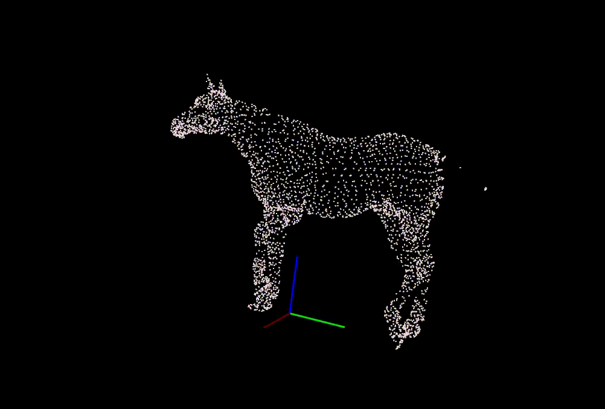

PclWalkerViewer
===============

PclWalkerViewer is a C++20 utility executable that walk (recursively on demand) a directory and sequentially display
the point clouds its contains into a PCL 3D viewer. It supports PCD and PLY format.
The viewer is controlled by keyboard inputs.



## Build and install

```sh
mkdir build && cd build &&\
cmake -DCMAKE_BUILD_TYPE=Release .. &&\
make &&\
sudo make install
```
## Usage

Upon call, you need to provide the directory to walk into and search clouds:

```sh
pcl_walker_viewer -d /directory/to/walk
```

By default, the walker will only search for clouds into the provided directory. However, using the _**-r**_ option, the walker
will recursively descend into subdirectories and search for clouds into them:

```sh
pcl_walker_viewer -r -d /directory/to/walk
```
or (using long options)
```sh
pcl_walker_viewer --recursive --directory /directory/to/walk
```

### Keymap

You can control the viewer using the following inputs of the keyboard:
- [<-] [->] (Left or Right arrow) to display the previous/next cloud
- [d] to change the color of the cloud
- [t] to toggle the display of origin coordinate system
- [Up] to increase the size of the origin coordinate system
- [Down] to decrease the size of the origin coordinate system

### Load strategy

Two strategies for the loading the clouds are supported:
- **Immediate**: Using this strategy, the walker will load into memory all the found clouds. This strategy offer quicker reaction
time from the viewer when displaying the next or previous cloud, especially for large clouds. It comes however at 
the cost of more memory consumption.
- **Just in time**: This strategy will load the clouds in memory only when the viewer need to display them. It is better when using
very large clouds on a system with limited memory. It comes however with more latency when requesting to display the next or previous
cloud as the system has to first load the cloud into memory.

By default, the system operates with the **Just in time** strategy. The strategy can be selected using the _**-s**_ option:
```sh
pcl_walker_viewer -r -d /directory/to/walk -s immediate
```
or

```sh
pcl_walker_viewer -r -d /directory/to/walk -s jit
```

## Dependencies

- At least [Point Cloud Libary](https://www.pointclouds.org/) 1.9.
- At least [Boost](https://www.boost.org/) 1.71.0.
- A compiler supporting [C++20](https://en.cppreference.com/w/cpp/compiler_support/20) (concepts and range libraries are required).

## Feedback

Don't hesitate if you have any suggestions for improving this project, or if you find any error. I will be glad to
hear from you. Contributions are welcomed :)

## License

Distributed under the MIT Software License (X11 license).
See accompanying file LICENSE.
